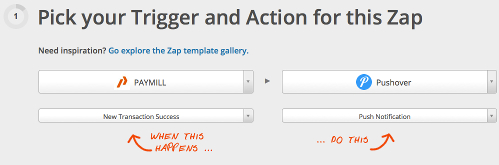
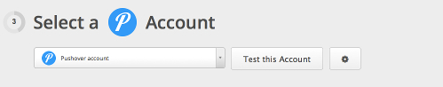
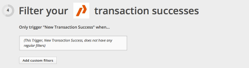
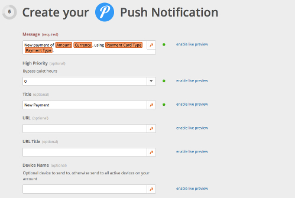
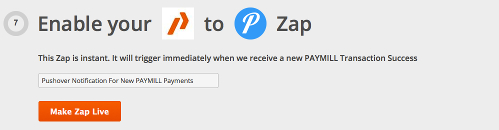

# Receiving Pushover notification from PAYMILL

Hello all,

following up our REST API integration on Zapier.com, Pushover.net was recently added to their service list and we would liek to talk about how you can use it to receive real-time notifications of PAYMILL payments.

Pushover is a simple REST API for real-time notifications on Android and iOS devices and connecting your PAYMILL account to Pushover allows you to get notified when new payments are received on your mobile and tablet devices.

Setting up Pushover notifications is straighforward, although it requires a Zapier Basic Plan. Official mobile clients are also available on App Stores. The list of official clients is available at [https://pushover.net/clients](https://pushover.net/clients) .

Let's go over the simple steps. After completing your sign-up for both [http://zapier.com](http://zapier.com) and [http://pushover.net](http://pushover.net), if you haven't already, you can create a new Zap on your Zapier Dashboard and select "PAYMILL" and "Pushover" as your services. Optionally you can also select the "Push Notification from New Transaction Success" item from the list of related [Zap templates](https://zapier.com/app/explore?services=paymill,pushover) and select "Use This Zap", this will take you to the Zap form.

On the next step you connect your PAYMILL

and Pushover account

Next, let's test both accounts before proceding. Then on step 4 

we can add data filters for transactions and on step 5 we configure the notification message

On step 6 we test can test the Zap.  with sample data

and finally set a title and make it live

That's it! When new payments are fullfiled on your PAYMILL account, you'll get a notification through Pushover

